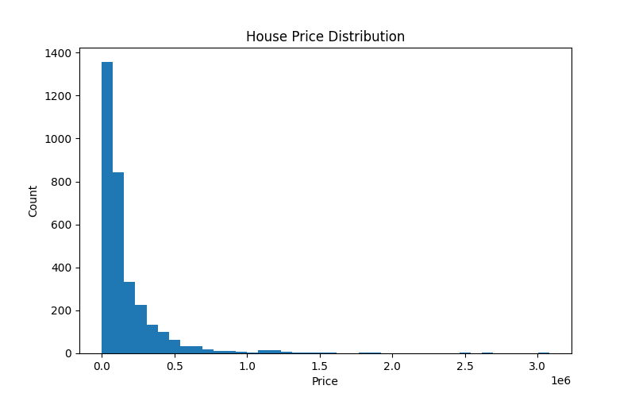
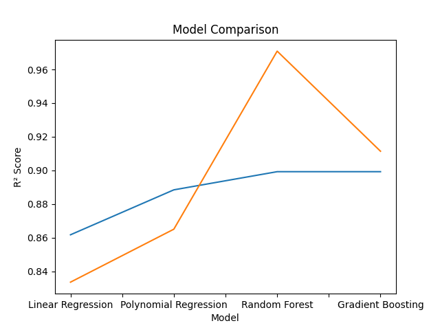
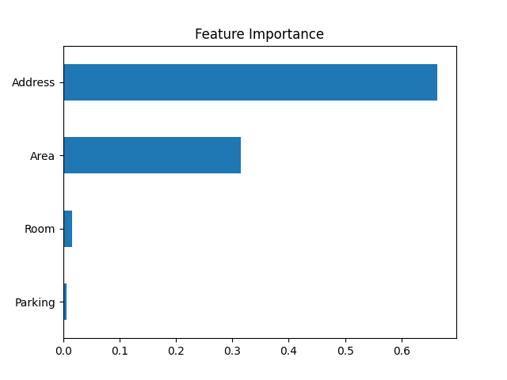
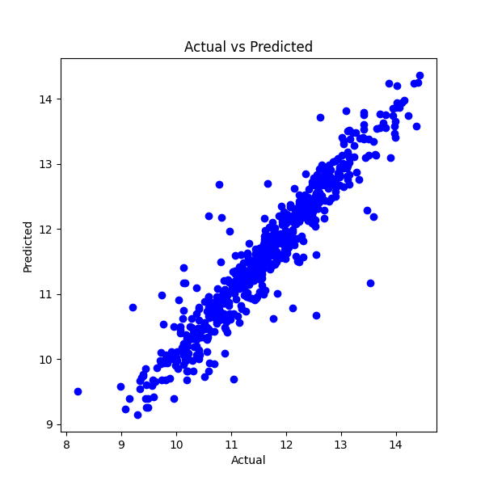
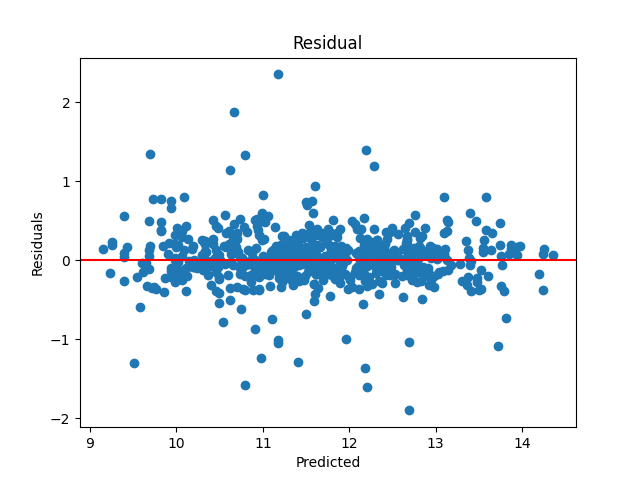

# House Price Prediction using Machine Learning


---

## Project Overview

This project presents an end-to-end Machine Learning pipeline for predicting house prices using supervised regression techniques.

The project covers the complete workflow of a typical regression problem, including:

- Data Cleaning
- Exploratory Data Analysis (EDA)
- Feature Engineering
- Manual Target Encoding with Smoothing
- Log Transformation
- Feature Scaling
- Model Training
- Hyperparameter Tuning
- Model Evaluation
- Model Persistence

Four regression algorithms were implemented and compared to identify the most suitable model for predicting house prices.

---

## Objectives

The primary goals of this project are:

- Build a complete regression pipeline from raw data to prediction.
- Explore and analyze the dataset through EDA.
- Apply feature engineering to improve predictive performance.
- Compare multiple regression algorithms.
- Optimize the best model using GridSearchCV.
- Save the trained model together with preprocessing objects for future inference.

---

## Dataset

**Source**

Kaggle – House Price Dataset

### Dataset Information

| Property | Value |
|-----------|------:|
| Samples | 3,479 |
| Features | 8 |
| Target | Price (USD) |

### Features Used

| Feature | Description |
|----------|-------------|
| Area | House area (square meters) |
| Room | Number of rooms |
| Parking | Parking availability |
| Address | District (Target Encoded) |

---

## Target Variable

The original **Price (USD)** distribution was highly right-skewed.

To reduce skewness and improve model performance, a logarithmic transformation was applied before training.

---

## Project Structure

```text
House-Price-Prediction-Regression/

├── data
│   └── housePrice.csv
│
├── images
│   ├── heatmap.png
│   ├── house_price_distribution.png
│   ├── feature_importance.png
│   ├── model_comparison.png
│   ├── actual_vs_predicted.png
│   └── residual_plot.png
│
├── models
│   ├── house_price_model.pkl
│   ├── scaler.pkl
│   └── smoothing_map.pkl
│
├── notebooks
│   └── House_Price_Regression.ipynb
│
├── README.md
├── requirements.txt
└── .gitignore
```

---

## Machine Learning Workflow

```text
Raw Dataset
      │
      ▼
Data Cleaning
      │
      ▼
Exploratory Data Analysis
      │
      ▼
Feature Engineering
      │
      ▼
Log Transformation
      │
      ▼
Train / Test Split
      │
      ▼
Manual Target Encoding
      │
      ▼
StandardScaler
      │
      ▼
Model Training
      │
      ▼
Hyperparameter Tuning
      │
      ▼
Model Evaluation
      │
      ▼
Model Persistence
```

This workflow minimizes data leakage by ensuring preprocessing is consistently applied before model training.

---

## Key Features

- End-to-end Machine Learning workflow
- Comprehensive Exploratory Data Analysis (EDA)
- Data Cleaning and preprocessing
- Manual implementation of Target Encoding with smoothing
- Log transformation of the target variable
- Feature scaling using StandardScaler
- Comparison of four regression models
- Hyperparameter tuning using GridSearchCV
- Feature importance analysis
- Residual analysis
- Model persistence using Joblib
- Prediction-ready trained model
---

# Exploratory Data Analysis (EDA)

Before building the machine learning models, an extensive exploratory data analysis (EDA) was conducted to better understand the dataset and identify patterns, relationships, and potential data quality issues.

The analysis included:

- Distribution analysis of numerical variables
- Correlation analysis
- Missing value inspection
- Duplicate record detection
- Outlier visualization
- Target variable distribution analysis

The insights obtained from EDA guided the preprocessing and feature engineering steps applied later in the project.

---

## House Price Distribution

The original target variable (**Price (USD)**) showed a highly right-skewed distribution.

To reduce skewness and improve regression performance, a logarithmic transformation was applied before training the models.

<p align="center">
    
</p>

---

## Correlation Analysis

A Pearson correlation heatmap was generated to investigate the relationships between numerical features.

This analysis helped identify the variables most strongly associated with house prices and provided useful insights for feature selection.

<p align="center">
    
</p>

---

# Data Cleaning

The dataset was cleaned and prepared before model development.

The preprocessing process included:

- Removing missing values
- Removing duplicate records
- Verifying data consistency
- Converting Boolean features into numerical values
- Preparing categorical features for machine learning

These steps ensured that the dataset was suitable for model training.

---

# Feature Engineering

Several feature engineering techniques were applied to improve model performance.

## Manual Target Encoding

The **Address** feature is a categorical variable with many unique districts.

Instead of using One-Hot Encoding, a custom Target Encoding approach was implemented manually.

To reduce overfitting, smoothing was incorporated into the encoding process using the global target mean.

The resulting encoding dictionary was saved as:

- `smoothing_map.pkl`

This allows new data to be encoded consistently during future predictions.

---

## Log Transformation

The target variable (**Price (USD)**) was transformed using the natural logarithm before model training.

This transformation provides several benefits:

- Reduces skewness
- Improves numerical stability
- Makes regression learning easier
- Reduces the influence of extremely expensive houses

---

## Feature Scaling

Numerical features were standardized using **StandardScaler**.

The fitted scaler was saved as:

- `scaler.pkl`

This guarantees that future input data receives exactly the same preprocessing as the training data.

---

# Machine Learning Models

Four regression algorithms were implemented and evaluated.

| Model | Description |
|--------|-------------|
| Linear Regression | Baseline regression model |
| Polynomial Regression | Captures nonlinear relationships |
| Random Forest Regressor | Ensemble learning using multiple decision trees |
| Gradient Boosting Regressor | Sequential ensemble learning |

Additionally, a simple Linear Regression model was created during the exploratory stage to visualize the relationship between house area and house price.

---

# Hyperparameter Tuning

To improve predictive performance, **GridSearchCV** was applied to optimize the Random Forest Regressor.

Different combinations of hyperparameters were evaluated using cross-validation, and the best-performing configuration was selected for the final model.
---

# Model Evaluation

The performance of each regression model was evaluated using three standard regression metrics:

- **Mean Absolute Error (MAE)**
- **Mean Squared Error (MSE)**
- **Coefficient of Determination (R²)**

The comparison below summarizes the performance of all implemented models.

<p align="center">
    
</p>

---

# Model Performance Summary

| Model | MAE ↓ | MSE ↓ | Test R² ↑ | Train R² |
|--------|-------:|-------:|-----------:|----------:|
| Linear Regression | 0.2841 | 0.1686 | 0.8618 | 0.8336 |
| Polynomial Regression | 0.2448 | 0.1360 | 0.8885 | 0.8651 |
| **Random Forest Regressor** | **0.2285** | **0.1229** | **0.8993** | **0.9709** |
| Gradient Boosting Regressor | **0.2285** | **0.1229** | **0.8993** | **0.9114** |

The ensemble learning models achieved the highest predictive performance and significantly outperformed the linear regression models.

---

# Feature Importance

Feature importance analysis was performed using the trained **Random Forest Regressor**.

The results indicate that the encoded **Address** feature contributes the most to house price prediction, followed by **Area** and the remaining numerical features.

<p align="center">
    
</p>

---

# Prediction Analysis

To evaluate prediction quality, the predicted values were compared with the actual values.

<p align="center">
    
</p>

The close alignment of the predicted values with the reference line demonstrates that the model is able to capture the underlying relationship between the input features and house prices.

---

# Residual Analysis

Residual analysis was performed to investigate the prediction errors.

<p align="center">
    
</p>

The residuals are randomly distributed around zero without a clear pattern, indicating that the selected model provides a good fit to the data.

---

# Key Findings

Several important observations were made throughout this project:

- Applying a logarithmic transformation reduced the skewness of the target variable and improved regression performance.
- Manual Target Encoding with smoothing successfully transformed the high-cardinality **Address** feature into a meaningful numerical representation.
- Ensemble learning methods significantly outperformed the linear regression models.
- Random Forest and Gradient Boosting achieved almost identical performance on the test dataset.
- Although Random Forest obtained a higher training R² score, both ensemble models generalized equally well on unseen data.
- Feature importance analysis showed that the encoded **Address** feature was the strongest predictor of house prices.

Considering its strong predictive performance after hyperparameter optimization, the **Random Forest Regressor** was selected as the final model.

---

# Saved Models

The following artifacts were saved for future inference:

| File | Purpose |
|------|---------|
| `house_price_model.pkl` | Trained Random Forest model |
| `scaler.pkl` | Fitted StandardScaler |
| `smoothing_map.pkl` | Target Encoding dictionary with smoothing |

These files enable consistent preprocessing and prediction for new house data.

---

# Technologies Used

- Python
- Pandas
- NumPy
- Matplotlib
- Seaborn
- Scikit-learn
- Joblib
- Jupyter Notebook

---

# How to Run

Clone the repository:

```bash
git clone https://github.com/Farhood-2025/House-Price-Prediction-Regression.git
```

Navigate to the project directory:

```bash
cd House-Price-Prediction-Regression
```

Install the required dependencies:

```bash
pip install -r requirements.txt
```

Open the notebook:

```bash
jupyter notebook notebooks/House_Price_Regression.ipynb
```

---

# Repository Structure

```text
House-Price-Prediction-Regression/
│
├── data/
├── images/
├── models/
├── notebooks/
│   └── House_Price_Regression.ipynb
│
├── README.md
├── requirements.txt
└── .gitignore
```

---

# License

This project is released under the MIT License.

---

# Author

**Farhood**

Machine Learning & Data Science Enthusiast

GitHub:
https://github.com/Farhood-2025